# Transmisión del tipo de cambio hacia los precios domésticos en Colombia (2005-2025)

Proyecto de econometría aplicada desarrollado en EViews para analizar el exchange rate pass-through en Colombia mediante un modelo VAR no restringido.

El objetivo principal es evaluar cómo los choques en el tipo de cambio nominal COP/USD se transmiten hacia los distintos niveles de precios de la economía colombiana: precios de importación, precios al productor y precios al consumidor.

---

# Serie histórica de la TRM

Evolución del tipo de cambio nominal COP/USD durante el período de análisis.

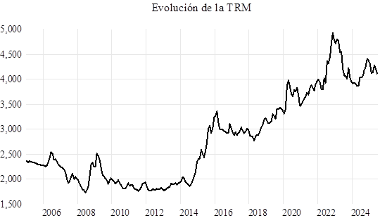

---

# Objetivo del estudio

Analizar la magnitud y velocidad del traspaso cambiario hacia los precios domésticos en Colombia durante el período 2005-2025.

El proyecto busca responder:

- ¿Qué tan fuerte es la transmisión del tipo de cambio hacia los precios internos?
- ¿Qué tan rápido ocurre el ajuste?
- ¿Cómo cambia la intensidad del traspaso a lo largo de la cadena de precios?

---

# Metodología

El análisis se realiza mediante un modelo VAR (Vector Autoregressive Model) estimado con datos mensuales para el período 2005-2025.

## Características del modelo

- Modelo VAR no restringido
- Variables en primeras diferencias logarítmicas
- 13 rezagos
- Identificación estructural mediante descomposición de Cholesky
- Funciones impulso-respuesta acumuladas
- Intervalos de confianza mediante simulaciones Monte Carlo

## Variables incluidas

- TRM (COP/USD)
- Índice de precios de importación (IMP)
- Índice de precios al productor (IPP)
- Índice de precios al consumidor (IPC)

---

# Pruebas econométricas y diagnóstico

## Estacionariedad (KPSS)

Se realizaron pruebas KPSS para verificar la integración de orden uno de las series.

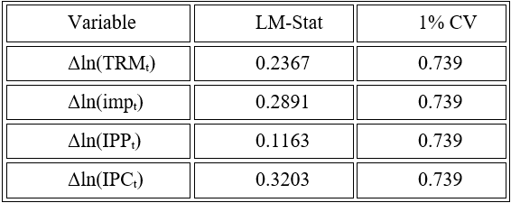

---

## Selección de rezagos

La longitud óptima del VAR se seleccionó mediante criterios de información y validación econométrica.

---

## Estabilidad dinámica del VAR

Se verificó que todas las raíces inversas del polinomio característico se ubicaran dentro del círculo unitario.

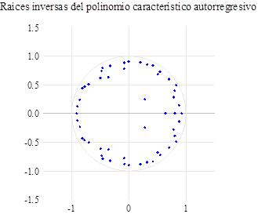

---

## Prueba LM de autocorrelación residual

Se evaluó la independencia serial de los residuos del modelo.

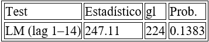

---

## Normalidad multivariante

Se aplicó la prueba de Lütkepohl / Jarque-Bera multivariante.

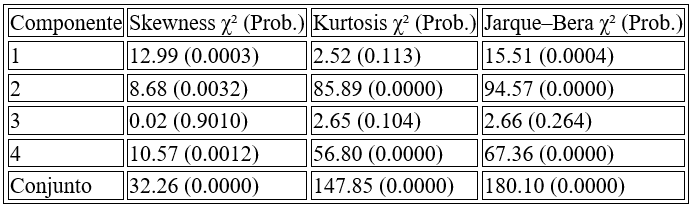

---

## Causalidad de Granger

Se analizaron las relaciones dinámicas entre tipo de cambio y niveles de precios.

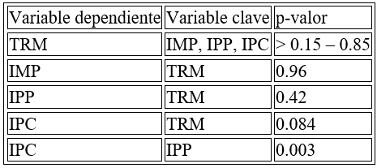

---

# Funciones impulso-respuesta

Las IRF acumuladas permiten observar cómo un shock positivo en el tipo de cambio se transmite hacia los diferentes niveles de precios.

## Respuesta de precios de importación

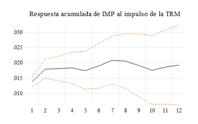

---

## Respuesta de precios al productor

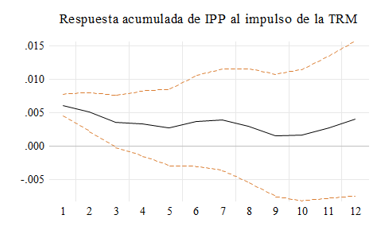

---

## Respuesta de precios al consumidor

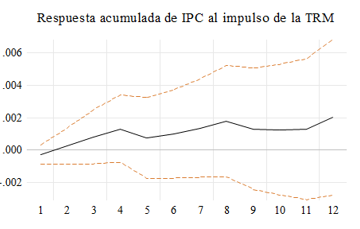

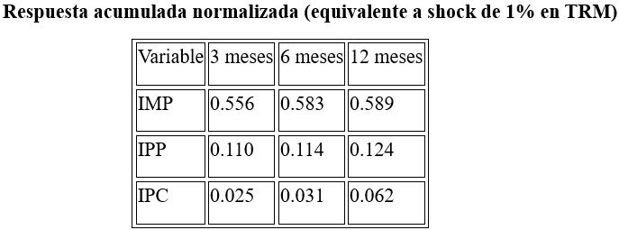

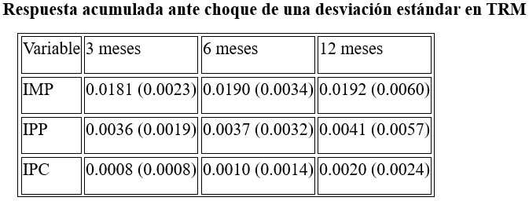

---

# Resultados principales

Los resultados muestran un traspaso cambiario:

- Alto hacia precios de importación
- Moderado hacia precios al productor
- Bajo hacia precios al consumidor

---

# Software utilizado

- EViews

# Referencias

- Rowland, P. (2003). *Exchange rate pass-through to domestic prices: The case of Colombia.*
- McCarthy, J. (2000). *Pass-through of exchange rates and import prices to domestic inflation.*
- Goldberg, P. & Knetter, M. (1997). *Goods Prices and Exchange Rates.*
- Menon, J. (1995). *Exchange Rate Pass-through.*
